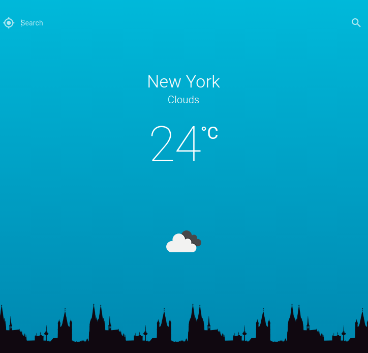

# Quasar Weather

A Quasar Weather app is build using Quasar Framework which help to build cross platform application with a single code base. Wann have a look, Here [Quasar.dev](https://quasar.dev/) :heart_eyes:

| Platform           | Supports           |
| :----------------- | :----------------- |
| Linux              | :heavy_check_mark: |
| Window             | :heavy_check_mark: |
| Mac                | :heavy_check_mark: |
| Android            | :heavy_check_mark: |
| ios                | :heavy_check_mark: |
| SPA                | :heavy_check_mark: |
| SSR                | :heavy_check_mark: |
| PWA                | :heavy_check_mark: |
| Browser extenstion | :heavy_check_mark: |

## Install the dependencies

```bash
npm install
```

### Start the app in development mode (hot-code reloading, error reporting, etc.)

```bash
quasar dev
```

### Build the app for production

All you have to do is use Quasar Cli to build for different platform using specific paltform configuartion which can be found in Quasar Docs.

```bash
quasar build
```

### Icongenie

```bash
sudo npm install -g @quasar/icongenie --unsafe-perm
```

### Customize the configuration

See [Configuring quasar.conf.js](https://quasar.dev/quasar-cli/quasar-conf-js).

# A Simple Weather app


